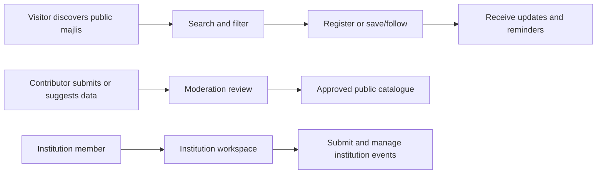
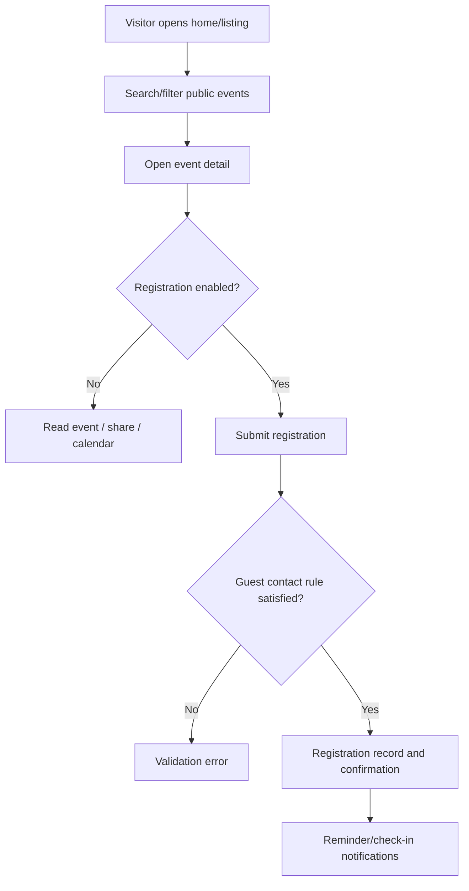
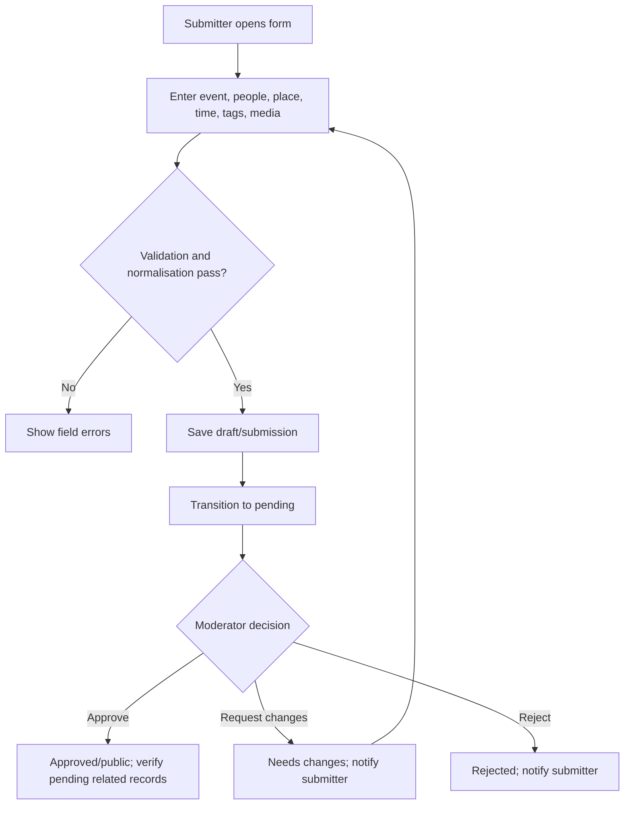
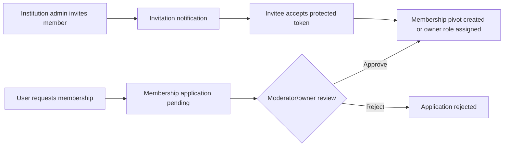
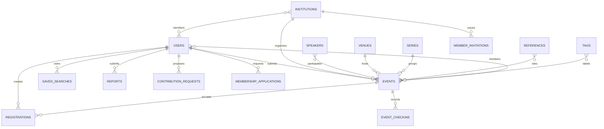
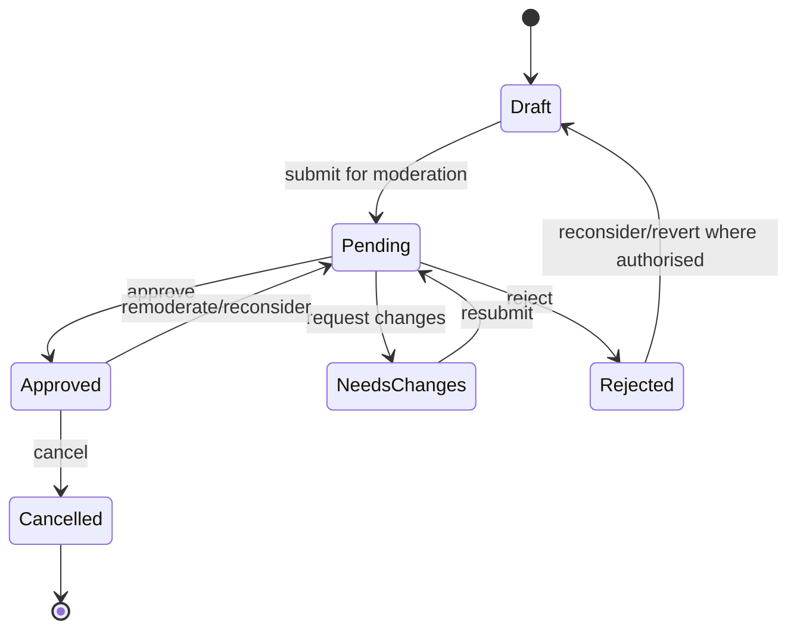

# ilmu360° — Reverse-Engineered Product Requirements Document

## 1. Document control

| Field | Value |
|---|---|
| Document | Reverse-engineered PRD |
| Product | ilmu360° (repository package: `aiarmada/ilmu360`) |
| Reconstruction date | 2026-07-17 |
| Evidence scope | Source repository, indexed code graph, migrations, tests, configuration, route definitions |
| Runtime verification | Not performed in this reconstruction; no running URL or authenticated environment was supplied |
| Change policy | Application code was not modified; this document is the only produced artefact |

## 2. Executive summary

ilmu360° is a Malay-first web platform for discovering, publishing, moderating, and attending Islamic knowledge events (“majlis”), together with directory records for institutions, speakers, venues, series, and references. It also supports user contributions, institution membership/workspaces, event registration and check-in, saved searches, following and sharing, notifications, reports, and staff administration.

The core product loop is:

The implementation is a Laravel 13 / PHP 8.4 monolith with Livewire public and authenticated screens, Filament administrative panels, REST-style `/api/v1` endpoints, Laravel MCP servers, queued jobs, scheduled commands, database-backed state, media storage, Scout search with Typesense/database fallbacks, and package-based capabilities from the AIArmada ecosystem. [Evidence: `composer.json`, `routes/web.php`, `routes/api.php`, `routes/ai.php`, `routes/console.php`]

## 3. How this PRD was reconstructed

The repository was indexed into the codebase knowledge graph (`46,521` nodes and `141,418` edges; status `ready`). Discovery used graph architecture/search for routes, classes, and symbols, then source inspection for route files, Composer/npm configuration, migrations, jobs, policies, states, services, and tests. `vendor`, build outputs, and many generated/storage directories were excluded from the graph. Documentation was treated as supporting evidence only; it was not treated as proof where implementation disagreed.

Runtime behaviour could not be validated. Therefore claims below describe implemented code and tested behaviour, not observed production behaviour.

## 4. Evidence and confidence model

| Label | Meaning |
|---|---|
| Confirmed | Directly present in implementation, schema, route, or a passing/explicit test |
| Supported | Several implementation surfaces agree, but no single source proves the full workflow |
| Unverified | Plausible from configuration or naming; runtime or complete call path unavailable |
| Contradicted | Sources disagree or legacy/backup code conflicts with active code |
| Missing | The repository does not provide enough evidence |

## 5. Product overview

### Product identity

**Confirmed:** a public event and Islamic-knowledge directory plus authenticated contribution and administration workflows. Public routes expose `/majlis`, `/institusi`, `/penceramah`, `/tempat`, `/siri`, and `/rujukan`; event submission is exposed at `/tambah-majlis` and `/hantar-majlis`. [Evidence: `routes/web.php`]

**Supported:** the product serves Malaysian/Malay-speaking users seeking trustworthy Islamic learning opportunities and organisations publishing or maintaining them. Evidence includes Malay route vocabulary, Malaysia geography seeders, prayer-time fields/enums, `EventType`, `InstitutionType`, `ReferenceType`, and about-page assets/copy. [Evidence: `database/seeders/MalaysiaCitySeeder.php`, `database/seeders/DistrictSeeder.php`, `database/seeders/SubdistrictSeeder.php`, `app/Enums/EventPrayerTime.php`, `public/images/about/*`]

**Business model:** no implemented paid plan, checkout, subscription, invoice, refund, commission, or payout workflow was identified in the active application routes/models/migrations. The product is therefore currently best classified as a public information/community platform with operational administration, not a confirmed commerce product. Commerce packages are dependencies, but dependency presence is not proof of an active commercial flow. [Evidence: `composer.json`; absence of corresponding active application routes and tables is a Missing/Unverified conclusion]

### Apparent maturity

**Supported:** early production or advanced MVP moving toward production. Evidence includes 220 test files, explicit moderation/escalation workflows, audit/activity logging, API/MCP surfaces, Horizon scheduling, slug redirects, search fallbacks, and migrations dated through July 2026. **Contradicted/limiting evidence:** backup resource directories, `.bak` files, `docs/trash`, experimental routes (`/glm`, `/kimi`), test-only routes, and unfinished/legacy migration cleanup indicate an active rewrite/cutover rather than a fully settled mature product.

## 6. Product purpose and value proposition

### Likely goals

| Goal | Evidence | Confidence | Success measure |
|---|---|---|---|
| Help people find relevant Islamic events | Public event listing, detail, search, filters, calendar export, public visibility policy | Supported | Public event discovery, detail views, registrations, saved searches |
| Improve trust and data quality | Event moderation states, verified/pending directory records, reports, audits, escalation job | Confirmed | Approval SLA, rejection rate, report resolution time, duplicate rate |
| Let the community fill catalogue gaps | Contribution and membership application routes/actions; pending speaker/institution tests | Confirmed | Accepted contributions per active contributor |
| Give institutions a managed publishing surface | Institution dashboard, member pivots, invitations, workspace API, institution event routes | Confirmed | Active institutions, events submitted per institution, membership actions |
| Keep users informed after intent | Notification service, saved-search matches, follows, reminders, digest settings | Confirmed | Notification delivery/read rate, registration attendance |
| Extend product access to agents/mobile clients | `/api/v1`, MCP member/admin servers, manifests and tokens | Confirmed | API/MCP usage and successful requests |

### Non-goals evidenced by current implementation

No active evidence supports payment processing, subscription billing, a mobile-native app, multi-tenant billing, or a general-purpose content-management system. These are **Missing**, not necessarily deliberate permanent non-goals.

## 7. Domain and industry context

The domain is Islamic education and community event discovery in Malaysia. A **majlis** is an event or gathering. A **penceramah** is a speaker. An **institusi** is an organisation/institution. A **rujukan** is a reference/source. A **sumbangan** is a user contribution or suggested correction. An **ahli** is a member in an institution/speaker/reference/event relationship. These meanings are strongly supported by route names, enum names, models, UI tests, and seeders; exact organisational policy remains partly unverified.

## 8. Terminology glossary

| Term | Meaning in this product |
|---|---|
| Majlis | Public event or learning gathering |
| Event | Database/application record for a majlis |
| Institution | Organisation associated with events, speakers, spaces, donation channels, and members |
| Speaker | Person who presents or participates in events |
| Venue / Tempat | Physical or online location for an event |
| Series | Group or recurring collection of events |
| Reference | Knowledge/reference source linked to events or followed by users |
| Contribution | Suggested new or changed catalogue data submitted by a user |
| Membership application | Request to be recognised as a member of an institution, speaker, reference, or event subject |
| Moderation | Review process that decides whether submitted data becomes public |
| Visibility | Whether an entity is public, unlisted, or private |
| Status | Lifecycle state such as draft, pending, approved, rejected, or needs changes |
| Saved search | Persisted search filters owned by an authenticated user |
| Follow | User subscription to updates for supported subjects |
| Dawah share | Tracked sharing of catalogue content through social/share providers |
| MCP | Model Context Protocol surface used by AI agents to access member/admin capabilities |
| Filament | Administrative UI framework used for resources and panels |
| Livewire | Server-driven UI framework used for public and dashboard screens |
| Horizon | Laravel queue monitoring and worker dashboard |
| Typesense | Optional search engine used through Laravel Scout |

## 9. Users, actors, and personas

| Actor | Objectives | Confirmed capabilities / restrictions |
|---|---|---|
| Anonymous visitor | Discover events and directory records | Public listings/details, search, calendar, social sharing; cannot use authenticated dashboard workflows |
| Registered member | Register, save, follow, contribute, report, manage notifications | Authenticated dashboard, saved searches, contributions, membership applications, reports, event registration; exact account verification rules depend on Fortify configuration |
| Event submitter | Publish a proposed majlis | Creates event submission; may edit draft/needs-changes/pending records subject to policy |
| Institution administrator/member | Maintain institution presence and events | Invitations and member-role management are supported by workspace and relation-manager tests |
| Moderator / Ahli reviewer | Review events and membership/contribution/report queues | Filament Ahli/admin resources, moderation APIs, policies, approval/rejection/request-changes flows |
| Global administrator | Operate catalogue, users, permissions, settings, integrations | Filament resources/panels, admin APIs, MCP admin access, audit and deleted-user screens |
| API client / mobile client | Consume or mutate supported capabilities programmatically | `/api/v1`, bearer/session auth, manifests, registration/export/search/notification/contribution/workspace APIs |
| MCP member agent | Perform member-scoped agent operations | `/mcp/member`, Sanctum/API auth, `EnsureMemberMcpAccess` |
| MCP admin agent | Perform admin-scoped agent operations | `/mcp/admin`, Sanctum/API auth, `EnsureAdminMcpAccess` |
| Scheduler/queue worker | Execute reminders, escalations, media, digests, maintenance | Laravel scheduled jobs and commands |
| External providers | OAuth, search, storage, email/messaging, social sharing | Provider presence varies; credentials and production configuration are not available |

### Permissions matrix

| Capability | Visitor | Member | Institution member/admin | Moderator | Global admin | API/MCP agent |
|---|---:|---:|---:|---:|---:|---:|
| Browse public catalogue | ✓ | ✓ | ✓ | ✓ | ✓ | ✓ |
| Register for event | —/guest rules vary | ✓ | ✓ | ✓ | ✓ | ✓ |
| Save/follow/search alerts | — | ✓ | ✓ | ✓ | ✓ | ✓ |
| Submit event/contribution/report | —/public form may start | ✓ | ✓ | ✓ | ✓ | ✓ |
| Manage institution members | — | — | scoped | — | ✓ | scoped |
| Moderate records | — | — | — | ✓ | ✓ | admin-scoped |
| Manage users/roles/settings | — | — | — | limited | ✓ | admin-scoped |

Exact role assignment and package permission names must be confirmed from `database/seeders/RoleSeeder.php`, `database/seeders/PermissionSeeder.php`, `app/Policies/*`, Filament panel providers, and package configuration during implementation.

## 10. Product modules

1. Public discovery and catalogue: events, institutions, speakers, venues, series, references, inspirations.
2. Event publishing: public submission, advanced event creation, drafts, moderation, change announcements, calendar/pass/check-in.
3. Registration and attendance: event registration, passes, check-in, exports, going/saved endpoints.
4. Contributions and data stewardship: institution/speaker submissions, suggested updates, reports, membership claims.
5. Institution workspaces: institution dashboard, members, invitations, events, spaces, donation channels.
6. Search and personalisation: query/filter search, Typesense/database fallback, saved searches, follows, location/geography filters.
7. Notifications and communications: inbox, email, push/WhatsApp channels, settings, digests, reminders.
8. Sharing and impact: share redirects, tracked links, impact analytics.
9. Administration and moderation: Filament resources/panels, queues, audits, approvals, reports, AI usage/pricing.
10. API and AI-agent access: `/api/v1` resources/manifests and member/admin MCP servers.

## 11. Complete feature catalogue

| ID | Feature | Status | Evidence |
|---|---|---|---|
| AUTH-001 | Registration and login | Confirmed | Fortify routes/config; `routes/web.php`; `app/Actions/Fortify/CreateNewUser.php`; auth tests |
| AUTH-002 | Google OAuth | Confirmed in code | `SocialiteController`; `/oauth/{provider}/redirect|callback` |
| AUTH-003 | Password reset and email verification | Confirmed in code | Fortify controllers; auth notifications; `/forgot-password` route in graph |
| CAT-001 | Public event listing/detail | Confirmed | `routes/web.php`; `app/Livewire/Pages/Events/*`; `app/Models/Event.php` |
| CAT-002 | Public directory listings | Confirmed | institution/speaker/venue/reference/series routes and Livewire pages |
| CAT-003 | Search and advanced filters | Confirmed | `SearchIndex`, `Events/Index`, `AdvancedFiltersPanel`, Scout config, search tests |
| EVT-001 | Public event submission | Confirmed | `/tambah-majlis`, `/hantar-majlis`, submission actions/tests |
| EVT-002 | Advanced authenticated event creation | Confirmed | `CreateAdvanced`, `/dashboard/majlis/cipta-lanjutan` |
| EVT-003 | Moderation lifecycle | Confirmed | Event states/transitions, `ModerationQueue`, admin moderation API, tests |
| EVT-004 | Event registration/pass/check-in | Confirmed | `EventRegistrationController`, `EventPassController`, `EventCheckInController`, registration tests |
| EVT-005 | Calendar export | Confirmed | `EventsController::calendar`, `.ics` route |
| CONTR-001 | Submit institution/speaker | Confirmed | contribution Livewire pages/controllers/tests |
| CONTR-002 | Suggest update | Confirmed | `SuggestUpdate`, `ContributionController`, contribution request model/migration |
| MOD-001 | Reports and triage | Confirmed | report routes/resource/controller/actions and report tests |
| MEM-001 | Membership applications | Confirmed | membership pages/controller/resource/tests |
| MEM-002 | Institution invitations and roles | Confirmed | invitation model/notification, relation managers, invitation tests |
| USER-001 | Account settings | Confirmed | Livewire/API account settings |
| USER-002 | Saved searches | Confirmed | model/page/API/tests; max 10 rule tested |
| USER-003 | Follows | Confirmed | `FollowController`, supported subject route constraint |
| COMM-001 | In-app notifications | Confirmed | notification centre, inbox channel, notification page/tests |
| COMM-002 | Reminder/digest automation | Confirmed | `DispatchEventReminderNotifications`, `communications:send-digests`, console schedule |
| SHARE-001 | Tracked sharing and analytics | Confirmed | `DawahShareController`, share routes, dashboards/API |
| ADMIN-001 | Filament CRUD/admin resources | Confirmed | 137 files under `app/Filament` |
| ADMIN-002 | Audit/deleted-model views | Confirmed | audit resources, `deleted_models` migration, deleted-users page |
| API-001 | Versioned client/admin API | Confirmed | `routes/api.php`, controllers and manifests |
| API-002 | MCP member/admin servers | Confirmed | `routes/ai.php`, servers/controllers/middleware |
| OPS-001 | Escalation, orphan/media/search maintenance | Confirmed | `routes/console.php`, scheduled jobs/commands |
| COM-001 | Paid commerce | Missing as active product flow | No active billing evidence identified; commerce packages alone are insufficient |

For rebuild acceptance, each feature above should be implemented as an independently testable slice; source evidence is the current-behaviour baseline, not a promise that every path is production-complete.

## 12. Page and screen inventory

### Public screens

`/`, `/tentang-kami`, `/bahasa/{locale}`, `/carian`, `/majlis`, `/majlis/{event:slug}`, `/majlis/{event:slug}/kalendar.ics`, `/tambah-majlis`, `/hantar-majlis`, `/hantar-majlis/berjaya`, `/institusi`, `/institusi/{institution:slug}`, `/penceramah`, `/penceramah/{speaker:slug}`, `/tempat`, `/lokasi/{venue:slug}`, `/siri/{series:slug}`, `/rujukan`, `/rujukan/{reference:slug}`, `/kongsi/*`, sitemap routes, and authentication screens. [Evidence: `routes/web.php`]

### Authenticated screens

`/dashboard`, `/dashboard/dawah-impact`, `/dashboard/dawah-impact/links`, `/dashboard/dawah-impact/links/{link}`, `/dashboard/notifications`, `/tetapan-akaun`, `/dashboard/institusi`, `/dashboard/institusi/senarai-majlis`, `/dashboard/institusi/tambah-majlis`, `/dashboard/majlis/cipta-lanjutan`, `/carian-tersimpan`, `/jemputan-ahli/{token}`, `/sumbangan`, contribution creation/success/update screens, `/permohonan-keahlian`, `/pohon-keahlian/...`, and `/lapor/...`. [Evidence: `routes/web.php`]

### Administrative screens

Filament panels include admin dashboards, moderation queue, product signals, users, institutions, speakers, references, venues/spaces, series, tags, donation channels, reports, contribution requests, membership applications, inspirations, audits, AI model pricing/usage, slug redirects, and related-member/follower/event managers. [Evidence: `app/Filament/Pages/*`, `app/Filament/Resources/*`, `app/Filament/Ahli/*`]

### Screen-state requirements

The implementation and tests prove loading/rendered/empty/error variants for several public lists, search, invitations, saved searches, submissions, and moderation. A rebuild must explicitly cover: unauthenticated redirect, missing slug redirect, empty search, invalid invitation, rejected/needs-changes submission, validation errors, throttling, failed external search fallback, and successful completion notices.

## 13. Navigation and information architecture

The public information architecture is catalogue-first: home → search or directory → listing → detail → registration/share/follow/contribution. The authenticated architecture is dashboard-first: dashboard → notifications, settings, institution workspace, saved searches, contributions, membership, reports, and impact. Administration is separated into Filament panels/resources, while MCP and API clients use machine-readable routes. Malay canonical routes coexist with some English aliases/legacy routes, creating a terminology and migration risk.

## 14. End-to-end user journeys

### Discovery and registration

Evidence: public event routes, `EventsController::register`, registration safety tests, registration/pass/check-in controllers, reminder job and notification service.

### Event submission and moderation

Evidence: `CompleteFrontendEventSubmissionAction`, `PersistValidatedEventSubmissionAction`, event status transitions, `ApproveEvent`, `RequestChanges`, `RejectEvent`, `ReconsiderEvent`, moderation tests.

### Institution membership

Evidence: membership application resource/controller/tests, `MemberInvitation`, invitation notification and relation managers.

### Contribution/report

Authenticated users can submit institution/speaker records or suggest updates; reports are submitted against supported subjects and triaged by staff. Exact notification and duplicate rules vary by action and should be taken from the action tests before rebuild.

## 15. Functional requirements

### `AUTH-001` Account registration and authentication

**Status:** Confirmed  **Priority:** Critical  **Users:** Visitors, members  
**Source evidence:** `routes/web.php`; Fortify configuration/controllers; `app/Actions/Fortify/CreateNewUser.php`; auth notifications; API auth controller.

#### Purpose

Create a user identity for personalised actions and protect member/admin capabilities.

#### Requirement

The system must support registration, login, logout, password reset, email verification, and Google OAuth where configured. It must establish a session or API token appropriate to the client.

#### Preconditions and trigger

Visitor reaches an auth surface or client posts to the auth API; input must satisfy the active Fortify/API validation rules.

#### Main flow

1. Present registration/login form or API contract.
2. Validate credentials and required contact method.
3. Create/authenticate the user.
4. Send verification/welcome/reset notification where applicable.
5. Redirect to the intended dashboard or return an API response.

#### Failure flows

Invalid credentials, duplicate identity, missing contact information, expired reset/invitation token, unverified email, unsupported OAuth provider, throttling, and unauthorised access must return a clear error or redirect.

#### Acceptance criteria

`Given` valid registration data `When` submitted `Then` a user is created and the user receives the configured onboarding/verification behaviour. `Given` invalid credentials `When` login is attempted `Then` authentication fails without exposing whether a sensitive account exists. `Given` a guest `When` an authenticated route is opened `Then` the user is redirected to login.

### `EVT-001` Public event discovery

**Status:** Confirmed  **Priority:** Critical  **Users:** Visitors, members  
**Source evidence:** `routes/web.php`; `app/Livewire/Pages/Events/Index.php`; `Show.php`; `app/Models/Event.php`; public page tests.

The system must list and detail public events, apply supported keyword/geographic/date/taxonomy filters, respect status and visibility, preserve slug redirects, and expose share/calendar actions. Public policy evidence requires approved/public visibility; unlisted events can be reachable by link under policy. Acceptance: a public approved event appears in the listing/detail; a draft/private event does not; a stale slug resolves through redirect or returns a controlled not-found response; unsupported filters are ignored or rejected safely.

### `EVT-002` Event submission and moderation

**Status:** Confirmed  **Priority:** Critical  **Users:** Submitters, moderators, administrators  
**Source evidence:** `CompleteFrontendEventSubmissionAction`, `PersistValidatedEventSubmissionAction`, event state classes/transitions, `ModerationQueue`, moderation API, event submission tests.

The system must capture validated event data, save a draft or pending submission, permit authorised edits, and let reviewers approve, request changes, reject, reconsider, remoderate, cancel, or revert according to state rules. Approval may verify pending related institutions/speakers/venues/references. Acceptance criteria must assert state, timestamps/events/notifications, public visibility, and related-record side effects.

### `REG-001` Event registration and attendance

**Status:** Confirmed  **Priority:** High  **Users:** Guests/members, event operators  
**Source evidence:** `EventsController::register`, `EventRegistrationController`, `EventPassController`, `EventCheckInController`, `Registration`, `EventCheckin`, `EventRegistrationSafetyTest.php`.

The system must enforce event registration rules, collect an acceptable contact method for web guest registration, allow the implemented repeat-registration behaviour (tests explicitly state multiple registrations are allowed), issue/retrieve a pass, and support check-in where enabled. Registration changes and reminders may generate notifications.

### `CONTR-001` Community contributions and reports

**Status:** Confirmed  **Priority:** High  **Users:** Members, moderators  
**Source evidence:** contribution pages/controllers/actions, `ContributionRequest` migration/model, report actions/routes/resources/tests.

Members must be able to propose institution/speaker records, suggest changes, submit reports, and cancel applicable requests. Moderators must be able to review/triage and produce a terminal outcome. Exact subject and status values must follow the enums and action validation.

### `MEM-001` Membership applications and invitations

**Status:** Confirmed  **Priority:** High  **Users:** Members, institution owners/admins, moderators  
**Source evidence:** membership routes/controllers/resources, uniform membership pivots migration, invitation model/notification, `MemberInvitationUiTest`, membership admin tests.

The system must allow claimable membership applications and scoped invitations, protect invitation tokens, prevent unauthorised role management, and create/update membership pivots only after approval or acceptance.

### `SEARCH-001` Search, filters, saved searches, and alerts

**Status:** Confirmed  **Priority:** High  **Users:** Visitors, members  
**Source evidence:** `SearchIndex`, `AdvancedFiltersPanel`, `SavedSearch`, `SavedSearches/Index`, `SearchServiceFallbackTest`, `SavedSearchPageTest`, `config/scout.php`.

Search must use the configured Scout provider when available and fall back to database/local fuzzy search when Typesense fails. Authenticated users may save filters, edit names/notification settings, and delete saved searches; tests establish a maximum of 10 saved searches and normalisation of tampered filters.

### `COMM-001` Notifications and communications

**Status:** Confirmed  **Priority:** High  **Users:** Members, submitters, registrants, institution users, staff  
**Source evidence:** `EventNotificationService`, `NotificationSettingsManager`, notification channels, notification enums, console schedule, notification page/API.

The system must generate in-app and configured external notifications for submission outcomes, event changes, approvals, registration/check-in, reminders, saved-search matches, followed content, invitations, and reports. Delivery settings include cadence/frequency, destinations, preferred/fallback channels, digest time/day, and delivery status. Provider availability and production retry guarantees are unverified.

### `ADMIN-001` Administration and operations

**Status:** Confirmed  **Priority:** Critical  **Users:** Moderators, global administrators  
**Source evidence:** `app/Filament`, policies, role/permission seeders, admin API controllers, audit/deleted-model resources.

Administrators must be able to manage supported catalogue entities, review workflow queues, inspect audits and AI usage/pricing, manage users/roles, correct data, and operate scheduled maintenance. Scope checks must be enforced by policies/middleware, not only hidden UI actions.

### `API-001` API and MCP access

**Status:** Confirmed  **Priority:** Medium  **Users:** API clients, member/admin agents  
**Source evidence:** `routes/api.php`, `routes/ai.php`, MCP servers/controllers/middleware, manifests, token controllers.

The system must expose the implemented `/api/v1` contracts and separate member/admin MCP surfaces, authenticate with the configured guards/tokens, enforce scope middleware, return machine-readable validation/errors, and avoid exposing admin operations to member tokens.

## 16. Business rules catalogue

| ID | Rule | Enforcement | Evidence / confidence |
|---|---|---|---|
| BR-001 | Public event queries require an allowed public status and public visibility | Model scopes/policies/query | `Event.php`; `EventPolicy`; Confirmed |
| BR-002 | Unlisted events may be reachable by link but are not ordinary public listings | Policy/model | `EventPolicy`, `Event.php`; Supported |
| BR-003 | Event status is stateful, not a free-form boolean | State classes/transitions | `app/States/EventStatus/*`; Confirmed |
| BR-004 | Approval can verify pending related catalogue entities | Transition action | `ApproveEvent.php`; Confirmed |
| BR-005 | Guest web registration requires email or phone; authenticated users may register without either | Web validation/tests | `EventRegistrationSafetyTest.php`; Confirmed/implementation-specific |
| BR-006 | Users may store at most 10 saved searches | Action/page validation/test | `SavedSearchPageTest.php`; Confirmed |
| BR-007 | Supported follow subjects are institution, speaker, reference, and series | Route constraint | `routes/api.php`; Confirmed |
| BR-008 | Institution invitation management is scoped; global admins are not treated as institution invite managers in the tested UI | Tests/policies | `MemberInvitationUiTest.php`; Confirmed for tested UI |
| BR-009 | Geography uses country/state/city plus district/subdistrict address hierarchy | Seeders/address actions/guidelines | `database/seeders/*`; `AGENTS.md`; Supported |
| BR-010 | Search must have a local/database fallback when Typesense is unavailable | Search service/tests | `SearchServiceFallbackTest.php`; Confirmed |
| BR-011 | Scheduled jobs run without overlap and use explicit UTC/Malaysia timezone choices | Scheduler | `routes/console.php`; Confirmed |
| BR-012 | No active paid pricing/checkout lifecycle is evidenced | Active routes/schema inspection | Missing/Unverified, not a product rule |

## 17. Data model

### Core entities

| Entity/table | Purpose and key relationships |
|---|---|
| `users` | Identity, authentication, notification/account ownership; related to events, registrations, reports, contributions, memberships, follows, saved searches, audits |
| `events` | Majlis content, schedule, location, status, visibility, submitter and organiser relationships |
| `institutions` | Organisations; events, members, speakers, spaces, donation channels, invitations |
| `speakers` | Presenter/person profile; events, institutions, members, followers, search terms |
| `venues` / package address tables | Locations for events; public status/visibility and geographic data |
| `series` | Grouping of events and followed content |
| `references` | Sources linked to events and followed by users |
| `registrations` / `event_registrations` | Event attendance intent and contact/pass data; active model resolves to `event_registrations` per migration test |
| `event_checkins` | Attendance/check-in record |
| `event_submissions` | Submission-oriented event workflow data |
| `contribution_requests` | Proposed catalogue create/update requests with proposer, subject, type, status |
| `membership_applications` | Requests for membership/ownership claims |
| `member_invitations` | Protected invitations to entity membership |
| `reports` | User-submitted issue/report with open/triaged/resolved/dismissed lifecycle |
| `moderation_reviews` / `event_escalations` | Review and SLA escalation records |
| `saved_searches` | User-owned persisted filters and notification preference |
| `tags`, `taggables` | Spatie polymorphic tags; type/status/order |
| `donation_channels` | Institution-linked donation destinations; pending/verified/rejected/inactive status |
| `spaces`, `institution_space` | Physical/managed spaces and institution association |
| `media`, `media_links` | Uploaded/linked assets and entity attachments |
| `socialite` | Social account linkage |
| `personal_access_tokens`, `oauth_*` | Sanctum/Passport/API token infrastructure |
| `activity_log`, `audits`, `deleted_models` | Operational history and deleted model copies |
| `notifications`/package communication tables | In-app and multi-channel delivery state/settings |
| `ai_model_pricings`, `ai_usage_logs` | AI model configuration and usage accounting/observability |
| `slug_redirects` | Preserve old URLs after slug changes |
| `cache`, `jobs`, `job_batches`, `failed_jobs`, `sessions` | Framework runtime state |

Primary keys are generally UUIDs in application-owned migrations; foreign key database constraints/cascades are intentionally limited by project guidelines. Exact field-by-field rebuild schema must be generated from all migrations and package migrations, including package-owned tables.

### Entity relationship diagram

## 18. Data lifecycle and state machines

### Event state machine

State classes confirmed: `Draft`, `Pending`, `Approved`, `NeedsChanges`, `Rejected`, `Cancelled`; transitions include submit, approve, request changes, reject, reconsider, remoderate, cancel, and revert. Actual transition guards/side effects are in `app/States/EventStatus/Transitions/*`.

### Report state machine

`open → triaged → resolved` or `open/triaged → dismissed`; lifecycle timestamp handling is implemented in `SaveReportAction`. [Evidence: `app/Actions/Reports/SaveReportAction.php`]

### Other stateful records

Contribution requests, membership applications, registrations, notification deliveries, donation channels, inspirations, spaces, tags, and escalation records have status enums/strings. Their complete transition graphs require per-model/action extraction; current evidence confirms stateful storage but not every legal transition.

## 19. Authentication, authorisation, and tenancy

Authentication uses Laravel Fortify for web auth, Socialite for Google OAuth, Sanctum and Passport-related OAuth tables for API/MCP credentials, and session middleware for web routes. Admin/member MCP routes explicitly require `auth:sanctum,api` plus `EnsureAdminMcpAccess` or `EnsureMemberMcpAccess`. Web dashboard routes use `auth`. Resource-specific policies exist for events, institutions, speakers, venues, references, series, reports, tags, spaces, saved searches, registrations, donations, inspirations, and address entities.

**Tenancy:** no separate tenant/organisation database boundary is evident. Institutions act as scoped ownership/workspaces, with member pivots and invitations, but the system appears single-application/single-database rather than hard-isolated multi-tenant SaaS. Cross-tenant isolation is therefore a high-priority security verification item.

## 20. API catalogue

The active API is versioned under `/api/v1`. Major groups are:

| Group | Examples |
|---|---|
| Auth/current user | `/auth/register`, `/auth/logout`, verification notification, current-user endpoints |
| Event | event detail/search, registration, going, save, check-in, registration export |
| Frontend manifests/forms | `/forms/report`, `/forms/advanced-events`, `/forms/institution-workspace`, membership/contribution manifests |
| Account/notifications | `/account-settings`, MCP tokens, notification settings/destinations/messages |
| Contributions/membership | `/contributions`, subject suggestions, approve/reject/cancel, membership applications |
| Search/saved/follows | search, saved searches, follow subject endpoints |
| Sharing/telemetry | share analytics, mobile telemetry, GitHub issues |
| Reports | `/reports` |
| Admin | catalog, resources CRUD/batch/relations/schema, event moderation, report triage, contribution and membership review |
| Documentation | documentation index/sections/UI/JSON controllers |

Exact request/response schemas are implementation-defined by each controller/request/manifest and should be exported from `routes/api.php` plus controller validation. Rate limits are explicitly attached to registration, GitHub issues, reports, sharing, and search; a complete numeric catalogue is not available from route definitions alone.

## 21. External integrations

| Integration | Purpose | Evidence | Confidence |
|---|---|---|---|
| Google OAuth | Social login | Socialite controller/routes/config | Confirmed in code |
| Google Maps/Places | Location normalisation and place resolution | `NormalizeGoogleMapsInputAction`, `ResolveGooglePlaceSelectionAction`, tests | Confirmed in code; credentials/runtime unverified |
| Typesense | Search index | `docker-compose.yml`, Scout config, fallback tests | Confirmed optional |
| S3-compatible storage | Media/files | filesystem config and AWS package | Configured capability; production use unverified |
| Email | auth/transactional/digest notifications | mail config, notification classes | Confirmed in code; provider unverified |
| WhatsApp/push | Notification channels | `WhatsappChannel`, `PushChannel` | Confirmed in code; provider credentials/retry unverified |
| Social share providers | share redirect/tracking | `DawahShareController`, allowed providers | Confirmed |
| GitHub | Issue/report submission endpoint | `GitHubIssueController` | Confirmed in code; token/config unverified |
| OpenAI/other AI model services | AI features/usage pricing | `laravel/ai`, AI model pricing/usage tables/config | Configured/implemented pieces; user-facing product scope unverified |
| MCP OAuth/API | AI-agent access | `routes/ai.php`, MCP servers | Confirmed |

No webhook signature/retry/delivery-log contract was established for external incoming webhooks; treat as Missing unless found in package code.

## 22. Background jobs and scheduled processes

| Process | Schedule/trigger | Purpose |
|---|---|---|
| `DispatchEventReminderNotifications` | Every 15 minutes UTC | Reminder/check-in windows |
| `EscalatePendingEvents` | Hourly Asia/Kuala_Lumpur | SLA escalation for pending events |
| `app:prune-orphaned-entities` | Daily Malaysia time | Remove orphan institutions/speakers/venues after 48 hours |
| `app:sync-public-submission-locks` | Hourly Malaysia time | Reopen/lock public submission based on credibility rules |
| `media-library:clean` | Daily 02:30 Malaysia time | Orphan/deprecated media maintenance |
| `media-library:regenerate` | Weekly Sunday 03:00 Malaysia time | Missing responsive media conversions |
| `horizon:snapshot` | Every 5 minutes UTC | Queue throughput/wait-time dashboard data |
| `communications:send-digests` | Every minute UTC | Scheduled digest batches |
| Slug backfill jobs | Triggered by commands/actions | Backfill event/institution/speaker/reference/venue slugs |
| Responsive image job | Media event/queue | Generate conversions |

Evidence: `routes/console.php`, `app/Jobs/*`. Retry counts, backoff, idempotency, alerting, and worker capacity require inspection of each job and deployment configuration; several are Missing.

## 23. Notifications

Confirmed families include welcome, email verification, password reset, event submission, event approval/change/cancellation, report resolved, member invitation, saved-search match, followed-content update, registration confirmation/change, check-in confirmation, reminder/check-in open, escalation, and digest communications. Channels include in-app/inbox, email, push, and WhatsApp classes. User preferences are managed by `NotificationSettingsManager`; exact opt-out/legal basis and provider delivery guarantees are unverified.

## 24. Search, filtering, sorting, and reporting

Search covers events and directory subjects. It supports keyword/fuzzy/fallback search, geographic/address filters, event taxonomy, dates, key-person roles, saved filters, and public/authenticated scopes. Typesense is optionally containerised; database/local fallback is tested. Pagination is present in route/UI tests. Sorting varies by entity; speaker public order is explicitly tested as stable random rather than alphabetical. Reports include user-submitted issue records and admin triage; share analytics and product signals provide operational/product reporting. No confirmed export/reporting warehouse or BI integration is present.

## 25. Billing and commercial model

**Current implementation:** no confirmed billing workflow. `ai_model_pricings` and `ai_usage_logs` relate to AI cost/usage administration, not customer billing. Commerce-related packages are installed, but no active product/plan/subscription/checkout/invoice/refund/commission workflow is proven. Rebuild scope should exclude billing unless product owners confirm it exists outside this repository.

## 26. Administration and operations

Filament provides CRUD and workflow operations across core catalogue and operational entities. Dedicated pages include `AdminDashboard`, `PanelDashboard`, `ModerationQueue`, `ProductSignals`, `ShareAnalytics`, and `DeletedUsers`. Audits/activity logs support traceability. Operational tasks still likely require server access for queue workers, scheduler, Typesense, secrets, backups, and deployment; no complete operator runbook or health/SLO definition is present.

## 27. Analytics and success metrics

### Existing

Signals schema includes auth signup/email verification and notification read/read-all events; share analytics, mobile telemetry, Horizon snapshots, audit/activity logs, and AI usage logs exist. [Evidence: `ProductSignalSchemaRegistry`, `DawahShareController`, `config/product-signals.php`, `config/signals.php`, `config/horizon.php`]

### Recommended framework

North-star: **completed meaningful learning connections per month** = registrations/check-ins for approved public events, with a secondary discovery metric for high-quality event detail engagement.

Track acquisition (unique public visitors, search entry), activation (first detail view, first registration/save/follow), engagement (repeat discovery, saved-search alerts, follows), retention (monthly returning members), trust (approval SLA, report resolution), operations (queue wait, failed jobs, notification delivery), and business/community health (active institutions, accepted contributions, attendance rate). These recommendations are not currently implemented as a complete metric system.

## 28. Non-functional requirements

| Area | Current evidence | Requirement for rebuild | Confidence |
|---|---|---|---|
| Performance | Pagination, indexes, search fallback, cache tests, Horizon snapshots | Public listing/search must remain responsive under expected Malaysian event-directory traffic; load targets are Missing | Supported |
| Reliability | Transactions/actions, fallback search, without-overlap schedules, failed-jobs table | Jobs and moderation/registration must be idempotent or safely recoverable | Supported |
| Security | Fortify, Sanctum/Passport, policies, throttles, CSRF middleware, signed/protected invitations | Enforce authz server-side, rate-limit abuse, protect tokens/uploads, audit sensitive actions | Confirmed controls; coverage gaps possible |
| Privacy | User contact data, social accounts, telemetry/share tracking, notification destinations, audits | Publish retention/consent/deletion policy; minimise/log-redact personal data | Missing policy evidence |
| Accessibility | Tests assert accessible labels and icon controls | Keyboard, focus, semantic labels, contrast, error association, alternative text on all flows | Partially supported |
| Compatibility | Locale route and English language files; responsive image assets | Support configured locales and responsive web; browser/device matrix is Missing | Supported |
| Maintainability | Actions/services/contracts, 220 tests, package boundaries | Preserve domain seams; remove backup/trash ambiguity; document package contracts | Supported |

## 29. Security and privacy requirements

Must protect all authenticated routes with authentication and object-level policies; keep member/admin MCP scopes separate; validate all API/form input server-side; use CSRF protection for web mutations; throttle search, registration, reporting, sharing, and GitHub issue flows; protect invitation and pass tokens; prevent cross-institution/member access; secure uploaded media and external URLs; avoid secrets in logs; audit moderation/user/permission changes; support account deletion/export and retention disclosures. Current implementation proves many controls but not a complete threat model, rate-limit catalogue, encryption-at-rest policy, backup policy, or privacy notice. These are high-priority Missing requirements.

## 30. Accessibility requirements

Confirmed tests cover accessible labels on event submission, clear icon controls, translated placeholders, and some UI semantics. Rebuild acceptance must additionally verify keyboard-only navigation, focus after validation/modal actions, screen-reader names, error summaries, contrast, reduced motion, responsive tables/forms, and alt text for event/speaker/about imagery. Evidence is incomplete; do not claim full WCAG conformance.

## 31. Deployment and infrastructure

Required runtime: PHP 8.4, Laravel 13, Composer, Node/Vite/Tailwind, database/cache/session storage, queue workers/Horizon, scheduler, file storage, mail provider, optional Typesense, optional external OAuth/maps/notification/AI providers. `composer.json` defines setup/dev scripts; `docker-compose.yml` defines Typesense only. `.env.example` defines secret names and environment configuration; secret values are intentionally not reproduced. No CI workflow, hosting provider, rollback process, backup/restore runbook, or production health check was established from the inspected inventory.

## 32. Testing and acceptance catalogue

The repository contains 220 test files across unit/feature areas. Strongly evidenced suites cover public pages, auth, event registration safety, event lifecycle/moderation, search fallback, saved searches, memberships/invitations, geography deletion rules, slug generation, MCP token issuance, API endpoints, accessibility/page copy, and cache serialization. Missing or uncertain areas include full browser/E2E coverage, load/performance, external provider contract tests, backup/restore, complete API schema parity, privacy deletion/export, cross-tenant security, and production notification delivery.

Recommended acceptance catalogue:

1. Guest/member/admin auth and access denial.
2. Public event visibility/status and slug redirect behaviour.
3. Event submission validation, draft, pending, changes, rejection, approval, cancellation.
4. Related-record verification on approval.
5. Event registration/pass/check-in and reminder scheduling.
6. Search provider failure fallback and filter normalisation.
7. Saved-search limit, ownership, notification matching.
8. Contribution/report/membership lifecycle and scope checks.
9. Institution invitation acceptance/revocation and role restrictions.
10. Notification channel preference/fallback/digest delivery.
11. API schema/auth/rate-limit/idempotency tests.
12. MCP member/admin isolation tests.
13. Upload, media conversion, orphan cleanup, and URL safety.
14. Accessibility and responsive public/dashboard flows.
15. Security regression, audit log, deletion/export, and backup/restore tests.

## 33. Product limitations

The product is highly featureful but its contract is not fully consolidated. Active and legacy route vocabularies coexist, package cutover artifacts remain, some route graph entries are parser artefacts, and runtime/provider configuration is unavailable. Repeat event registration is intentionally permitted by a safety test, which may be surprising and should be confirmed as product policy. Search provider behaviour depends on optional Typesense. Paid commerce is not proven. Full API payloads, rate limits, and role assignment cannot be safely reconstructed from route names alone.

## 34. Incomplete or contradictory behaviours

| Gap ID | Finding | Impact | Severity | Confidence |
|---|---|---|---|---|
| GAP-001 | Active code, backup resources, `.bak`, and `docs/trash` coexist | Rebuilders may select obsolete behaviour | High | Confirmed |
| GAP-002 | English and Malay route vocabularies coexist | SEO, navigation, and API/UI terminology drift | Medium | Confirmed |
| GAP-003 | Commerce packages/config exist without active billing journey | Stakeholders may overestimate commercial readiness | High | Supported |
| GAP-004 | Provider credentials/retry/timeout behaviour is not verifiable | Production reliability/privacy risk | High | Missing |
| GAP-005 | No complete tenant-isolation model is evident | Cross-institution data exposure risk | High | Supported |
| GAP-006 | Full role/permission matrix requires package/provider inspection | Incorrect admin/member access risk | High | Missing |
| GAP-007 | Full schema includes package-owned tables not represented in app migrations | Rebuild schema may be incomplete | High | Confirmed |
| GAP-008 | CI/CD, backup, rollback, and SLO documentation not found | Operational recovery risk | High | Missing |
| GAP-009 | Accessibility evidence is partial, not full conformance | Exclusion/legal risk | Medium | Supported |
| GAP-010 | Runtime validation was unavailable | Implementation may differ under actual environment | High | Confirmed |

## 35. Risks and dependencies

Key dependencies are Laravel/Filament/Livewire/Fortify/Sanctum/Passport/Horizon/Octane, AIArmada domain packages, Typesense, Google OAuth/Maps, storage, mail, WhatsApp/push providers, and MCP tooling. Major risks are state/permission complexity, package cutover drift, external notification failure, search index divergence, geographic data integrity, personal-data retention, invitation/pass token abuse, queue/scheduler misconfiguration, and unclear operational ownership.

## 36. Recommended product improvements

1. Publish one canonical terminology and route map, with explicit redirects and deprecation dates.
2. Generate and version the API contract from controllers/manifests, including auth, errors, pagination, limits, and idempotency.
3. Complete a role/permission and institution-scope matrix, then add negative authorization tests.
4. Define event/contribution/membership/report state transition tables as product policy.
5. Add privacy notice, retention/deletion/export requirements, and sensitive-log review.
6. Add provider contract tests, delivery observability, retry/backoff, and dead-letter handling.
7. Create production runbooks for Typesense, Horizon, scheduler, media, backups, restores, and rollback.
8. Remove or clearly quarantine backup/trash/experimental code from rebuild scope.
9. Establish product analytics around discovery → registration → attendance and trust/quality SLAs.
10. Confirm whether commerce is a roadmap item; if not, remove ambiguity from product positioning.

## 37. Open questions

1. What is the authoritative production URL and current deployment topology?
2. Which user roles and package permissions are active in production?
3. Is an institution a legal tenant, a workspace, or only an ownership relationship?
4. Is multiple registration for one event a deliberate policy?
5. Which events require email verification, phone verification, or neither?
6. Which notification providers are enabled, and what are their retry/SLA rules?
7. Are Google Maps, Typesense, S3, GitHub, AI, WhatsApp, and push active in production?
8. What are the retention, deletion, consent, and data-export obligations?
9. Is payment/billing planned, experimental, or out of scope?
10. What is the canonical source for package migrations and production schema?
11. What are target traffic, latency, availability, and recovery objectives?
12. Which locales are officially supported beyond the English files and Malay routes?

## 38. Evidence index

| Evidence area | Primary sources |
|---|---|
| Runtime entry/config | `artisan`, `public/index.php`, `composer.json`, `package.json`, `vite.config.js`, `docker-compose.yml` |
| Web navigation | `routes/web.php`, `routes/console.php` |
| API | `routes/api.php`, `app/Http/Controllers/Api/**` |
| AI-agent access | `routes/ai.php`, `app/Mcp/**`, `app/Http/Controllers/Mcp/**`, MCP middleware |
| Domain entities | `app/Models/**`, `database/migrations/**`, package migrations |
| Event lifecycle | `app/States/EventStatus/**`, `app/Actions/Events/**`, `app/Policies/EventPolicy.php` |
| Moderation | `app/Filament/Pages/ModerationQueue.php`, admin moderation controllers, moderation tests |
| Search | `app/Livewire/Pages/Search/**`, `app/Services/**Search*`, `config/scout.php`, search tests, `docker-compose.yml` |
| Auth | Fortify config/actions/controllers, Socialite controller, Sanctum/Passport config/migrations |
| Notifications | `app/Services/Notifications/**`, `app/Notifications/**`, `config/notification-center.php`, console scheduler |
| Operations | `app/Jobs/**`, `routes/console.php`, Horizon config |
| QA | `tests/**`, `phpunit.xml`, `Pest.php`, test output/failure reports |
| Product/supporting docs | `README.md`, `docs/**`, `AGENTS.md`; supporting only where active code agrees |

## 39. Appendices

### Appendix A — repository inventory

The repository contains PHP/Laravel application code, JavaScript/CSS/Vite assets, YAML/TOML/configuration, Python/Bash support scripts, migrations/seeders, tests, documentation, public images/fonts, package/vendor integration points, and generated/storage artifacts. Indexed graph counts were: PHP 3,092 files; JavaScript 38; CSS 14; YAML 4; Python 4; HTML 3; Bash 2; TOML 1. Application counts included 40 models, 84 actions, 8 jobs, 12 notifications, 16 policies, 27 Livewire classes, 137 Filament files, 58 controllers, 33 app migrations, 37 seeders, and 220 test files.

### Appendix B — rebuild boundary

To rebuild faithfully, implement the active application surfaces in this document, import package migrations/contracts, reproduce the event and moderation state machines, implement the public/authenticated/admin/API/MCP surfaces, then verify all open questions against a real deployment. Do not copy backup resources, trash documents, generated views, or experimental routes into the product without confirming they are active.

### Appendix C — evidence limitations

Line-number citations were not generated for every symbol in this first reconstruction pass; citations use the narrowest available file/class/method reference. A second pass should add exact line ranges for the final implementation specification and export a complete field-level schema/API catalogue after package migrations and runtime configuration are available.
